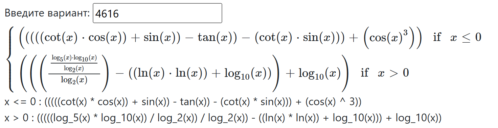
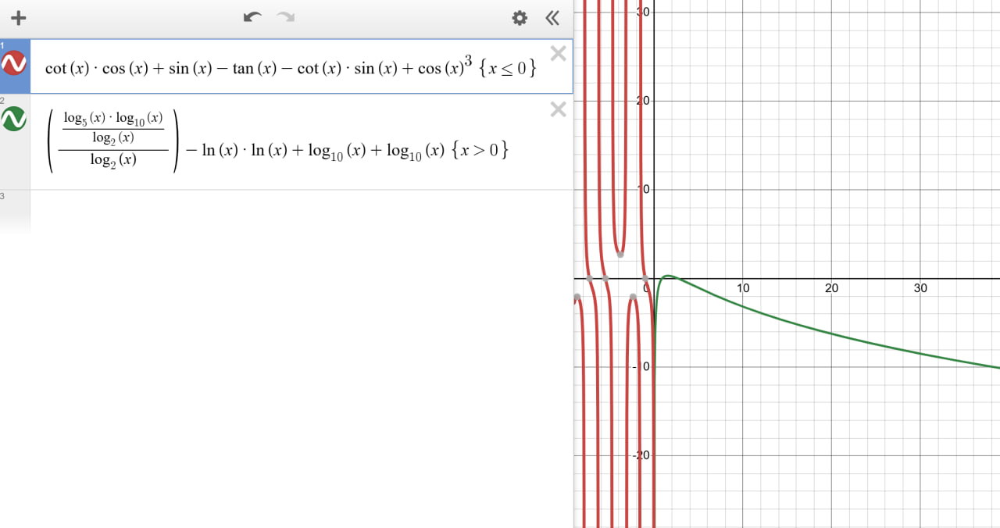
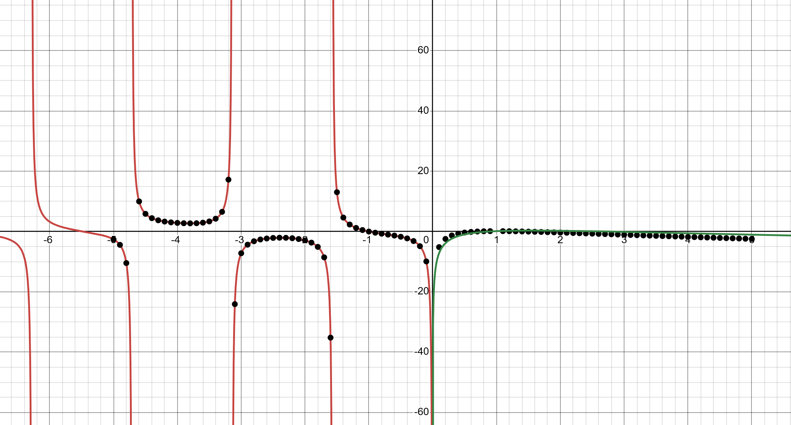

## Исходная функци



```
x <= 0 : (((((cot(x) * cos(x)) + sin(x)) - tan(x)) - (cot(x) * sin(x))) + (cos(x) ^ 3))
x > 0 : (((((log_5(x) * log_10(x)) / log_2(x)) / log_2(x)) - ((ln(x) * ln(x)) + log_10(x))) + log_10(x))
```



## Графическое отображение по точкам

